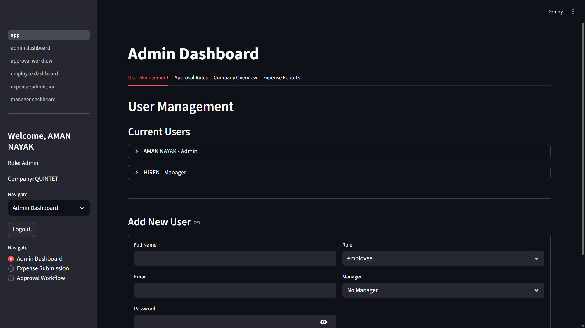

# Expense Management System

## Problem Statement
Companies often struggle with manual expense reimbursement processes that are time-consuming, error-prone, and lack transparency.  
There is no simple way to:
- Define approval flows based on thresholds.
- Manage multi-level approvals.
- Support flexible approval rules.

---

## Core Features

### Authentication & User Management
- On first login/signup:
  - A new Company (in the environment-selected country’s currency) and Admin User are auto-created.
- Admin can:
  - Create Employees & Managers.
  - Assign and change roles → Employee, Manager.
  - Define manager relationships for employees.

### Expense Submission (Employee Role)
- Employee can:
  - Submit expense claims (Amount, Category, Description, Date, etc.)
  - Amount can be different from the company’s currency.
  - View their expense history (Approved, Rejected).

### Approval Workflow (Manager/Admin Role)
- Expense is first approved by the manager if the **IS MANAGER APPROVER** field is checked.
- When multiple approvers are assigned, Admin can define their sequence.
  - Example:
    - Step 1 → Manager
    - Step 2 → Finance
    - Step 3 → Director
- Expense moves to the next approver only after the current one approves/rejects.

Managers can:
- View expenses waiting for approval.
- Approve/Reject with comments.

### Conditional Approval Flow
Approval Rule supports:
- **Percentage rule**: e.g., If 60% of approvers approve → Expense approved.
- **Specific approver rule**: e.g., If CFO approves → Expense auto-approved.
- **Hybrid rule**: Combine both (e.g., 60% OR CFO approves).
- Combinations of multiple approvers + conditional rules are supported.

### Role Permissions
- **Admin**: Create company, manage users, set roles, configure approval rules, view all expenses, override approvals.
- **Manager**: Approve/reject expenses, view team expenses, escalate as per rules.
- **Employee**: Submit expenses, view their own expenses, check approval status.

---

## Additional Features
- **OCR for receipts** (auto-read)
  - Employees can scan a receipt, and the OCR algorithm auto-generates expense fields (amount, date, description, expense type, etc.).
- **APIs**:
  - Country & Currency: [RestCountries API](https://restcountries.com/v3.1/all?fields=name,currencies)
  - Currency Conversion: [Exchange Rate API](https://api.exchangerate-api.com/v4/latest/{BASE_CURRENCY})

---

## Mockup
[View Mockup on Excalidraw](https://link.excalidraw.com/l/65VNwvy7c4X/4WSLZDTrhkA)

---
## Demo Video
🎥 [Watch the Demo Video](https://youtu.be/ynlQustfO-I)

---

## 🖼️ Project Screenshots

<details>
  <summary>📸 Click to view screenshots</summary>

  | Login Page                        | Admin Dashboard                             | Manager Dashboard                                        |
  | --------------------------------- | ------------------------------------------- | -------------------------------------------------------- |
  |  |  |  |

  | Employee Dashboard                                         | Admin Approval Flow                                 | Manager Approval Flow                           |
  | ---------------------------------------------------------- | --------------------------------------------------- | ----------------------------------------------- |
  |  |  |  |

</details>

---

## Tech Stack (Suggested)
- **Backend**: Python (Flask / Django)
- **Database**: SQKLite
- **Frontend**: HTML, CSS, JavaScript (React or Vue optional)
- **Authentication**: JWT / OAuth
- **APIs**: RestCountries, ExchangeRate API
- **OCR**: Tesseract OCR / Google Vision API

---
## 👨‍💻 Team Members

- **Aman Nayak**  
- **Vinit Patel**  
- **Hiren Dadhaniya**  
- **Sneha Prajapati**

---

## Setup Instructions
1. Clone this repository.
2. Create and activate a virtual environment:
   ```bash
   python -m venv venv
   venv\Scripts\activate   # On Windows
   source venv/bin/activate  # On Linux/Mac
   ```
3. Install dependencies:
   ```bash
   pip install -r requirements.txt
   ```
4. Run the application:
   ```bash
   python app.py
   ```

---

## License
This project is open-source and available under the MIT License.
